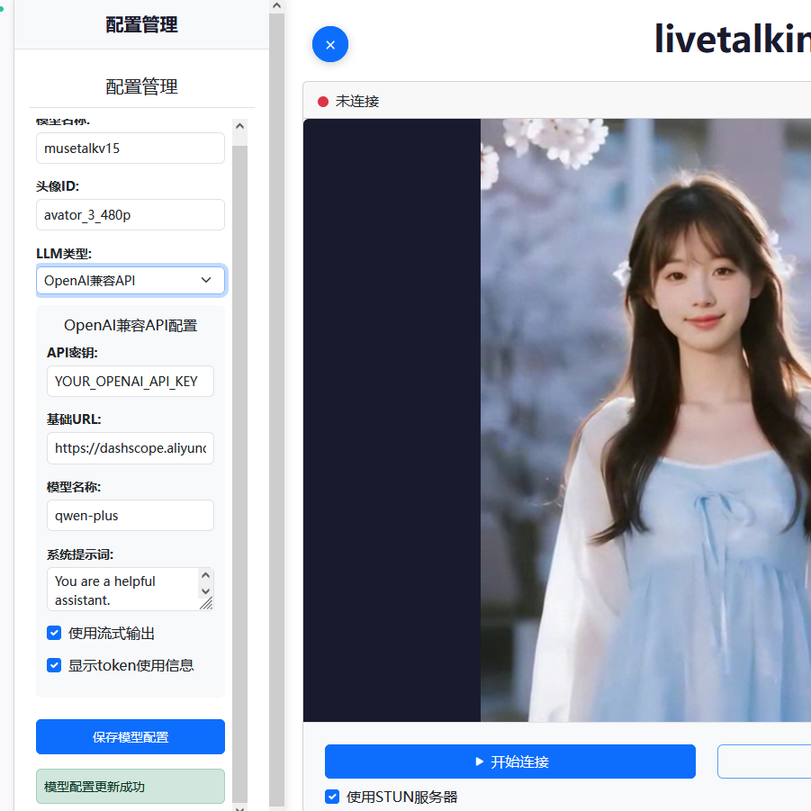
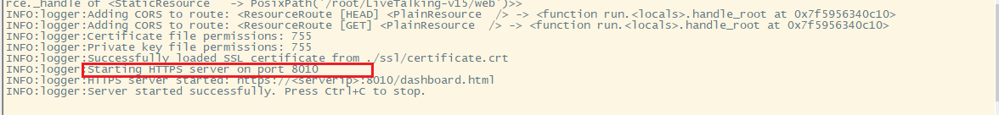
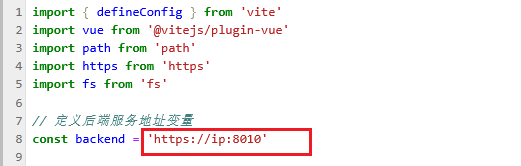
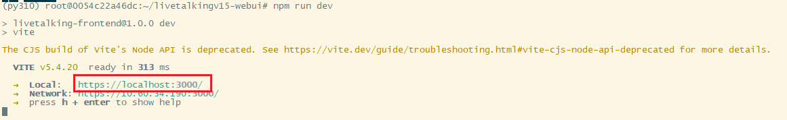
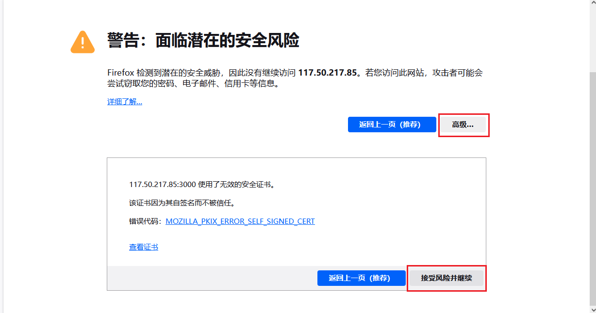
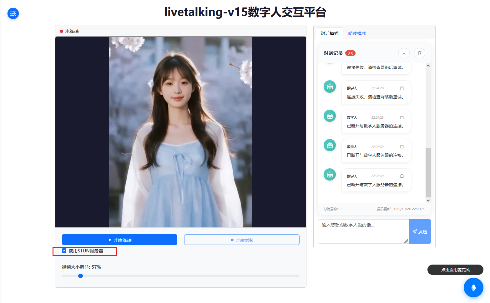

 # 本工程在 [LiveTalking](https://gitee.com/lipku/LiveTalking) 的基础上进行开发

 感谢 lipku 大佬的开源，对原工程感兴趣的请前往 [LiveTalking](https://gitee.com/lipku/LiveTalking) 查看。
  

# 开发说明

 1. 新增了musetalkv1.5模型的支持，
 2. 修改了原工程不能使用麦克风的bug
 3. 增加了本地语音识别功能（vosk）
 4. 语言大模型接入了coze的工作流（有了工作流，数字人就可以做更多的事情了）
 5. 对话模式增加了对话记录功能 - 2025-7-18
 6. 增加使用https功能，提供默认ssl证书，不用修改浏览器设置。 - 2025-9-23
 7. 增加麦克风持续收音功能 - 2025-9-23
 8. 前后端分离，前端使用vue，后端使用flask。前端工程见 [livetalkingv15-webui](https://gitee.com/brucezhao/livetalkingv15-webui)
 9. 新增配置管理功能，支持运行中切换数字人模型，支持运行中修改大语言模型。
 10. 增加https支持，默认提供自签名证书，也可以自己提供证书。
 11. 修改参数获取方式，从环境变量改为从配置文件中获取。配置文件为 `./conf/app_config.yaml`
 
 

 

# 部署说明
## 一. LiveTalking-v15 部署
### 1. 环境准备
python   3.10
pytorch  2.4
cuda     12.4

```bash
conda install pytorch==2.5.0 torchvision==0.20.0 torchaudio==2.5.0 pytorch-cuda=12.4 -c pytorch -c nvidia
```

### 2. 安装依赖

1. 基础依赖

```bash
git clone https://gitee.com/brucezhao/LiveTalking-v15.git
git checkout -b front-back-separa origin/front-back-separa
cd LiveTalking-v15

apt install libasound-dev portaudio19-dev libportaudio2 libportaudiocpp0 libgl1
pip install -r requirements.txt

# 下载musetalkv1.5模型权重
./scripts/download_musetalk_weights.sh
# 下载whisper-tiny模型权重
wget -O ./models/whisper/tiny.pt https://openaipublic.azureedge.net/main/whisper/models/65147644a518d12f04e32d6f3b26facc3f8dd46e5390956a9424a650c0ce22b9/tiny.pt
```

2. 配置本地语音识别模型

```bash
mkdir /root/voice-ai-persion
wget -O /root/voice-ai-persion/vosk-model-cn-0.22.zip https://alphacephei.com/vosk/models/vosk-model-cn-0.22.zip
cd /root/voice-ai-persion
unzip vosk-model-cn-0.22.zip
```

3. 修改配置文件

```bash
cp ./conf/app_config.yaml.example ./conf/app_config.yaml
vim ./conf/app_config.yaml

```

1. 修改配置文件中的 `avatar_id` 为你自己的数字人模型目录名。
2. 修改配置文件中的 `llm_type` 为你自己的大语言模型类型。这里支持2种类型："coze" 和 "openai"。
3. 如果选择 "coze" 类型，需要修改配置文件中的 `coze.api_token` 和 `coze.workflow_id` 为你自己的coze工作流。
4. 如果选择 "openai" 类型，支持所有openai的api接口（例如阿里百炼，openai等）。
    - 需要修改配置文件中的 `openai.api_key` 为你自己的openai api key。
    - 可以修改 `openai.base_url` 为你自己的openai api 地址。
    - 可以修改 `openai.model` 为你自己的openai模型。
    - 可以修改 `openai.system_prompt` 为你自己的系统提示词。

```yaml
# 服务器配置
server:
  # 基本参数配置
  fps: 50         # audio fps,must be 50
  l: 10
  r: 10

  # avatar 相关配置 <先修改>
  avatar_id: avator_3_480p       # define which avatar in data/avatars
  bbox_shift: 0
  batch_size: 25            # infer batch

  # 自定义视频配置
  customvideo_config: ""    # custom action json

  # TTS 配置
  tts: edgetts              # tts service type (xtts gpt-sovits cosyvoice)
  REF_FILE: zh-CN-XiaoyiNeural
  REF_TEXT: null
  TTS_SERVER: http://127.0.0.1:9880  # http://localhost:9000

  # 模型 配置
  model: musetalkv15           # musetalk wav2lip ultralight

  # 传输配置
  transport: webrtc        # webrtc rtcpush virtualcam
  # when use rtcpush, you can use push_url to set the url
  # push_url: "http://localhost:1985/rtc/v1/whip/?app=live&stream=livestream"  # rtmp://localhost/live/livestream


  # 会话和服务器配置
  max_session: 3            # multi session count
  listenport: 8010          # web listen port
  ssl_cert: "./ssl/certificate.crt"              # Path to SSL certificate file
  ssl_key: "./ssl/private.key"               # Path to SSL private key file


  llm_type: "coze"  # 可以是 "coze" 或 "openai" 

# LLM配置
llm:
  # OpenAI兼容API配置 <先修改>
  openai:
    api_key: "YOUR_OPENAI_API_KEY"  # OpenAI API密钥
    base_url: "https://api.openai.com/v1"  # DashScope SDK的base_url
    model: "qwen-plus"  # 使用的模型名称
    system_prompt: "You are a helpful assistant."  # 系统提示词
    stream: true  # 是否使用流式输出
    stream_options: 
      include_usage: true  # 是否在流式输出的最后一行展示token使用信息
  
  # Coze配置  <先修改>
  coze:
    api_token: "pat_gbaxxxxx"  # Coze API令牌
    workflow_id: "754xxxxxxx"  # Coze工作流ID
    base_url: "https://api.coze.cn"  # Coze API基础URL,可以不填,默认值为 https://api.coze.cn/
```

### 3. 启动服务
```bash
python app.py
```
如下图所示，服务启动成功后，会打印出服务地址和端口号。



## 二. 前端部署

1. 环境准备

node   v20.5.0

```bash
git clone https://gitee.com/brucezhao/livetalkingv15-webui.git
cd livetalkingv15-webui

npm install
```

2. 修改配置

修改`vite.config.js`中的backend为服务地址和端口号。




3. 启动前端服务

```bash
npm run dev
```


如下图所示，前端部署成功后，会打印出服务地址和端口号。



## 3. 访问服务

使用火狐浏览器打开 http://ip:3000 即可。**[不推荐谷歌浏览器，连接速度较慢]**

访问时会出现安全警告，这是因为我们使用了自签名证书。请点击高级设置，然后确认继续访问即可。





选中`使用STUN服务器`，点击`开始连接`即可。

## 使用说明

点击左上角的图标可以修改配置。修改完配置后，需要点击`保存`按钮，才能生效。

**注意： 如果修改了数字人模型，修改成功后，需要先断开当前连接，再重新点击`开始连接`按钮。！！！**


点击`启用麦克风`按钮，即可启用麦克风。可以与数字人进行连续语音交互。

## 注意:

本工程中没有数字人模型文件，可以在下面的连接中下载，解压后放到 `LiveTalking-v15/data/avatars` 路径下即可。或者也可以在`快速体验`部分中的镜像中提取

通过网盘分享的文件：avatars
链接: https://pan.baidu.com/s/1lAkKh-HFeDNZFlU3XIKKZw 提取码: 3hxq

# 快速体验

1. 镜像地址： https://www.compshare.cn/images/F8XaOMDnxdRq  用该镜像创建实例即可运行成功
2. 邀请连接： https://passport.compshare.cn/register?referral_code=ATnb90h6xxIEDxlOEvl46V
3. 如果连接失败，尝试打开网址：  https://你的ip:8010/api/config/model  ，授权后刷新网页重连即可


# 常见问题
## 1. EdgeTTS: NoAudioReceived exception in attempt 1/3: No audio was received. Please verify that your parameters are correct.

问题是 edge-tts api更新了，需要更新 edge-tts python 包

```bash
pip uninstall edge-tts
pip install edge-tts
```